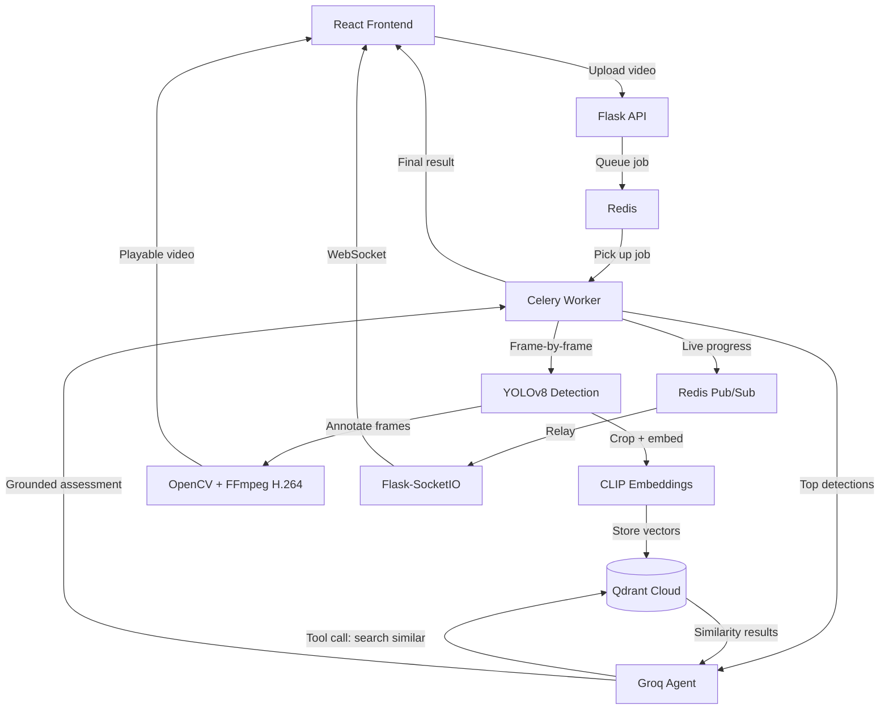

# SentinelVue

**A multi-camera anomaly detection system with agentic reasoning — not just object detection, but a system that remembers, retrieves, and explains what it sees.**

Upload a video → YOLOv8 detects objects in real time → every detection is embedded and stored in a vector database → a tool-using LLM agent searches that memory and writes a grounded assessment of whether each detection is routine or novel.


---

## Why this exists

Most portfolio computer vision projects stop at "here's a YOLO model with a Flask API." SentinelVue goes further: it's built as an end-to-end **production-style async system**, combining computer vision with the infrastructure patterns (async task queues, real-time streaming, vector search, agentic tool-use) that real ML/AI-infra teams actually run in production.

---

## Architecture



**The flow in plain English:** a video is uploaded and immediately queued for background processing — the user gets an instant response instead of a frozen page. A Celery worker picks up the job, runs YOLOv8 detection frame-by-frame, and streams live progress back over WebSockets. Every 10th frame's detections are cropped, embedded with CLIP, and stored in Qdrant as vector memory. Once processing finishes, the two highest-confidence detections are handed to an LLM agent, which decides *for itself* whether to search that vector memory for similar past events, then writes a short, grounded assessment — recurring pattern or novel event.

---

## Features

- **Async video processing** — Celery + Redis task queue, so long-running inference never blocks the API
- **Live progress streaming** — WebSockets (Flask-SocketIO) push real-time frame-by-frame progress to the UI, no polling
- **Object detection** — YOLOv8 (CPU-only inference)
- **Browser-compatible output** — automatic H.264 re-encoding via FFmpeg (OpenCV's default codec isn't browser-playable — a real gotcha this project surfaced and solved)
- **Vector memory** — every detection embedded via CLIP and stored in Qdrant Cloud, enabling similarity search over visual events
- **Agentic reasoning** — a Groq-hosted LLM agent with real tool-use: it decides when to query the vector database and writes a grounded, non-hallucinated assessment based on actual retrieved data
- **Custom design system** — a from-scratch UI (no template), built around a "daylight ops" visual identity with a recurring corner-bracket motif

---

## Tech Stack

| Layer | Technology |
|---|---|
| Frontend | React, Vite, Tailwind CSS v4 |
| Backend API | Flask, Flask-CORS |
| Async task queue | Celery, Redis (Memurai on Windows) |
| Real-time updates | Flask-SocketIO, Socket.IO client |
| Object detection | YOLOv8 (Ultralytics) |
| Video processing | OpenCV, FFmpeg (via imageio-ffmpeg) |
| Embeddings | CLIP (open_clip, ViT-B-32) |
| Vector database | Qdrant Cloud |
| Agent / LLM | Groq (openai/gpt-oss-120b) with function calling |

---

## Engineering decisions worth knowing about

A few deliberate tradeoffs made during this build — the kind of thing worth discussing in an interview:

- **Sampling detections every 10th frame for embedding**, rather than every frame — running CLIP on every single detection would meaningfully slow down an already CPU-bound pipeline. A production system would likely trigger embedding more selectively (e.g. only on high-confidence or motion-flagged detections) rather than a fixed interval.
- **Sequential Qdrant upserts, not batched** — each detection is stored with an individual API call. At scale, batching multiple points per request would meaningfully cut network overhead; kept sequential here for code clarity in a portfolio context.
- **Agent runs on the top-2 highest-confidence detections per video**, not every detection — keeps total runtime reasonable while still demonstrating the full reasoning pipeline. A production system might trigger agent analysis based on anomaly severity rather than a fixed count.
- **Network calls are wrapped defensively** — a single Qdrant or Groq request failing (timeout, transient network issue) does not crash the entire processing task; it's logged and the pipeline continues.

---

## Running it locally

### Prerequisites
- Python 3.12+
- Node.js
- Redis-compatible server (Memurai on Windows, or Redis directly on Mac/Linux)
- A [Qdrant Cloud](https://cloud.qdrant.io) free-tier cluster
- A [Groq](https://console.groq.com) API key (free tier)

### Backend
```bash
cd backend
python -m venv venv
venv\Scripts\activate       # Windows
pip install -r requirements.txt
```

Create a `.env` file in `backend/`:
```
QDRANT_URL=your-qdrant-cluster-url
QDRANT_API_KEY=your-qdrant-api-key
GROQ_API_KEY=your-groq-api-key
```

You'll need **three terminals** running simultaneously:
```bash
# Terminal 1 — Flask API
python run.py

# Terminal 2 — Celery worker
celery -A celery_worker.celery_app worker --loglevel=info --pool=solo
```

### Frontend
```bash
cd frontend
npm install
npm run dev
```

Visit `http://localhost:5173`.

---

## What I'd build next

- Multi-camera grid view, simulating a real ops-console with several concurrent feeds
- Batch vector upserts to reduce Qdrant network overhead
- A human-in-the-loop approval step before any agent-drafted action is treated as final
- Deployment via Docker Compose for one-command setup

---

## Author

Built by Mehak Faheem
